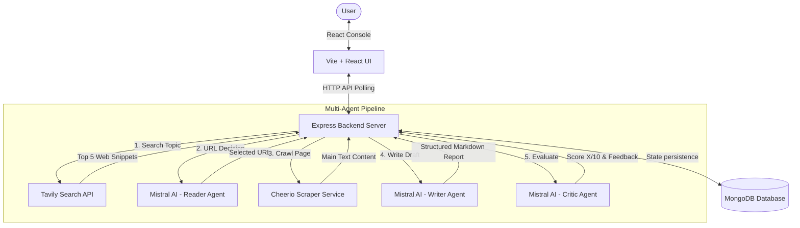

# ResearchMind - Multi-Agent Research System

ResearchMind is a premium full-stack MERN application that automates research and synthesis on any topic using a collaborative multi-agent execution pipeline. The application leverages a high-fidelity glassmorphism dark theme to deliver real-time progress visualization, structured report rendering, and detailed critiques.

---

## 🏗️ System Architecture

The application is built on a split client-server architecture with an asynchronous, state-driven agent pipeline.



### Flow Breakdown
1. **React UI**: The user submits a research topic. The UI triggers a background execution job and immediately displays a visual runner.
2. **Express API**: Receives requests, creates a `ResearchJob` entry in MongoDB, starts the pipeline asynchronously, and returns the Job ID.
3. **MongoDB State Machine**: Tracks job progress (`pending` ➔ `searching` ➔ `reading` ➔ `writing` ➔ `critiquing` ➔ `completed` / `failed`). The client polls the status endpoint every 1.5 seconds to refresh the progress runner.
4. **Agent Pipeline Service**: Orchestrates APIs (Tavily search, Mistral LLM completions) and crawls pages using Cheerio, saving results incrementally at each step.

---

## 🤖 Multi-Agent Pipeline Stages

ResearchMind splits the research workload across four specialized agent layers:

1. **Search Agent**: Translates the topic into search queries and calls the Tavily Search API. Collects the top 5 titles, URLs, and text snippets.
2. **Reader Agent**: Processes search snippets, calls Mistral to select the single most authoritative URL, and crawls it using Cheerio. It strips away scripts, styles, headers, and footers, keeping the main page text (truncated to 3,000 characters).
3. **Writer Agent**: Combines search snippets and the deep crawled source page. Uses Mistral to synthesize this information into a structured markdown report (containing Introduction, Key Findings, Conclusion, and Sources).
4. **Critic Agent**: Strictly reviews the generated report. Evaluates strengths, highlights weaknesses, scores the report out of 10, and generates a one-line verdict.

---

## 📂 Repository Structure

```
Multi_Agent/
├── backend/                  # Node.js + Express API server
│   ├── models/
│   │   └── ResearchJob.js    # Mongoose MongoDB schema
│   ├── services/
│   │   ├── agentService.js   # Main Mistral/Tavily orchestration
│   │   └── scraperService.js # Axios + Cheerio text extraction
│   ├── routes/
│   │   └── research.js       # REST Endpoints (Create, Get, List, Delete)
│   ├── server.js             # Express application entry point
│   ├── test_api.js           # Automated integration test script
│   └── package.json
│
├── frontend/                 # Vite + React Client
│   ├── src/
│   │   ├── components/
│   │   │   ├── Sidebar.jsx   # Custom glass navigation panel
│   │   │   ├── Dashboard.jsx # Metric summaries, input prompt, & history grid
│   │   │   ├── ResearchRunner.jsx # Live pipeline visualization & logs
│   │   │   └── ReportView.jsx # Markdown report viewer & score gauge
│   │   ├── index.css         # Glassmorphism dark-theme stylesheets
│   │   ├── App.jsx           # Client router and polling coordinator
│   │   └── main.jsx
│   ├── index.html
│   ├── vite.config.js
│   └── package.json
│
├── .env                      # Application API and DB keys
└── README.md
```

---

## ⚙️ Setup and Installation

### Prerequisites
- [Node.js](https://nodejs.org/) (v18+ recommended)
- [MongoDB](https://www.mongodb.com/try/download/community) (Running locally on default port `27017` or a remote Atlas Connection URL)
- Tavily API Key
- Mistral AI API Key

### 1. Environment Configurations
Create a `.env` file at the root of the project:
```env
TAVILY_API_KEY = "your_tavily_api_key"
MISTRAL_API_KEY = "your_mistral_api_key"
MONGODB_URI = "mongodb://127.0.0.1:27017/researchmind"
```
*(Note: If using MongoDB Atlas, replace `mongodb://127.0.0.1:27017/researchmind` with your connection string).*

### 2. Install Dependencies

**For Backend:**
```powershell
cd backend
npm install
```

**For Frontend:**
```powershell
cd ../frontend
npm install
```

---

## 🚀 Running the Application

Open two terminals or command lines:

#### Terminal 1: Launch Backend
```powershell
cd backend
npm start
```
*Starts API server on [http://localhost:5000](http://localhost:5000)*

#### Terminal 2: Launch Frontend
```powershell
cd frontend
npm run dev
```
*Starts client dashboard on [http://localhost:5173](http://localhost:5173)*

Open your browser to [http://localhost:5173](http://localhost:5173) to start researching!
